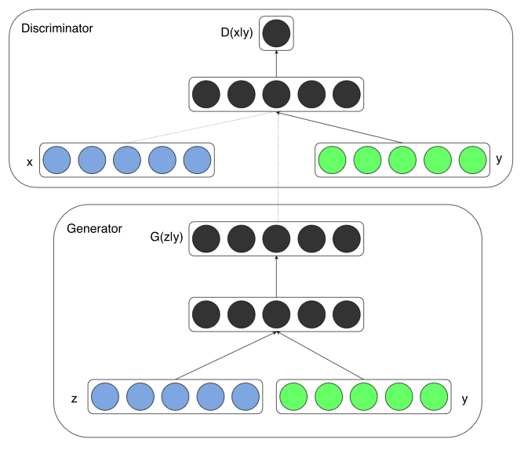

# Conditional GAN

## Summary

- GAN : generates results from noisy z(N(0,1))
- **Conditional-GAN** : generates results from noises(N(0,1)) and conditions(Y)
- conditions are needed both discriminator and generator.

## Model Description

- y : given conditions (e.g. tags, one-hot encoding, embeddings, ...)
- Variables
  - x : real data (not generated)
  - z : noises from `N(0,1)`
  - y : given conditions
- Log probabilties(higher is better)
  - `log(D(x|y))` : log probability that discriminator classify x as real with given y
  - `log(D(G(z|y)|y))` : log probability that discriminator classify `G(z|y)`(generated data) as real with given y
- Losses
  - discriminator : reduce `(-1) * (log(D(x|y))+log(1-D(G(z|y)|y))`
  - generator : reduce `(-1) * (log(D(G(z|y)|y)))`