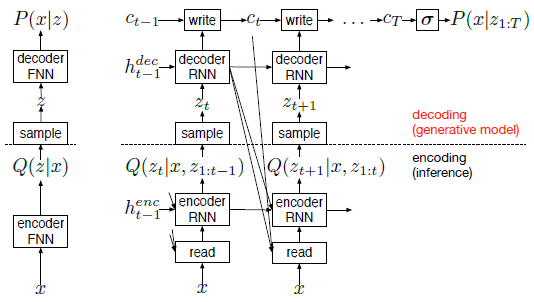

# DRAW

## Summary
- Generates images like "drawing"
- uses deep RNN layers(LSTM) with convolutional VAE
  - basic form and loss are almost same with VAE
  - Loss function(objective function) : `(negetive log-likely) + (KL-divergence)`
- works better with attention algorithms

## Model Description

- Left : Conventional VAE
- Right : DRAW Model
- Z -> Z1:t : Latent variables are serialized (such like time)
- VAE : Uses gaussian distribution to predict z. Because of "reparameterization trick"
  - reparameterization trick : `N(μ,σ) == (N(0,1)+μ)*σ`
- Variables
  - x't : error image
  - rt : computed **read** variable
  - htenc : encoder's hidden layer
  - htdec : decoder's hidden layer
  - zt : samples from `Q`
  - ct : computed **write** variable
- Computations
  - x't = x - sigmoid(ct-1)
  - rt = read(x,x't,ht-1dec) -> (NOTICE : error in paper)
  - htenc = RNNenc(ht-1enc, concat[rt,ht-1dec])
  - zt ~ Q(Zt|htenc)
  - htdec = RNNdec(ht-1dec,zt)
  - ct = ct-1 + write(htdec)

- Loss function
  - almost same with VAE
  - reconstruction loss : Lx = - logD(x|cT)
  - latent loss(KL divergence) : Lz = Sum(KL(Q(Zt|htenc||P(Zt)))) -> sum of KL divergences of z in each time
  - total loss : (reconstruction loss) + (latent loss)

- Read/Write Functions
  - without attention models
    - read(x,x't,ht-1dec) : concat[x,x't]
    - write(htdec)=W(htdec)
  - with selective attention model
    - use gaussian filters
    - multiplication with filters in read/write functions